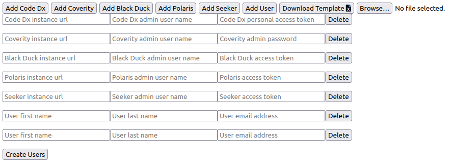

# How To

1. `git clone https://github.com/shanko07/synopsys-instance-creator.git`
2. `pip install -r requirements.txt`
3. `python app.py`
4. Open [the site](http://localhost:5000)

To use the utility you simply "Add" whichever Synopsys servers you'd like to add users to with the accompanying admin
credentials on those servers. Then you "Add" the users. The utility will automatically generate passwords, create the
users as admins, and save the necessary information in `creds.txt`.

:warning: The contents of `creds.txt` are plaintext usernames and passwords for admin users. They are never transmitted
over the network, but please be careful with this file. :warning: